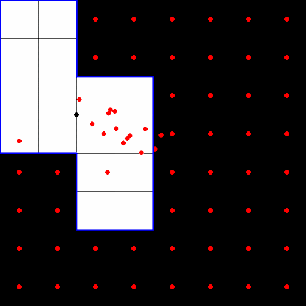
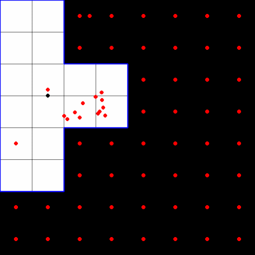

# Neural Cellular Automaton for Decentralized Inference in Distributed Manipulation Systems

  
  

## Problem

Distributed manipulation systems employ a grid of independently controlled actuators to achieve precise manipulation of objects resting on their surface. Despite the decentralized nature of the actuators, current implementations use centralized feedback mechanisms to provide information about the object’s position to the controllers. This centralized approach introduces a potential vulnerability, as a failure in the feedback system could result in the complete failure of the system.

## Solution

We propose an approach for characterizing objects in a network of sensing agents. These agents work collaboratively to determine a global property (the geometric center of the object) through local communication of the information at their disposal. The method uses a Neural Cellular Automaton, a multi-agent system in which the update rule of each agent is expressed as a Neural Network, and it is a function of its neighborhood's information.

## Experiments & Conclusions

We defined two sets of objects shapes: Tetrominoes and Unknown Shapes. The model was trained with the first set, and its performance was evaluated in both sets.

  
  

The experiment shows a remarkable degree of adaptation for most of the shapes in the unknown set of objects except for those with a pronounced degree of concavity or holes. This can be explained by the lack of objects with these characteristics in the training set. On the other hand, this experiment shows that, although being robust enough to adapt to unseeing shapes, the methodology did not result in a general solution, but rather in a solution for a specific subset of shapes.

  
  

## Behavior Examples

  
  
  
  

